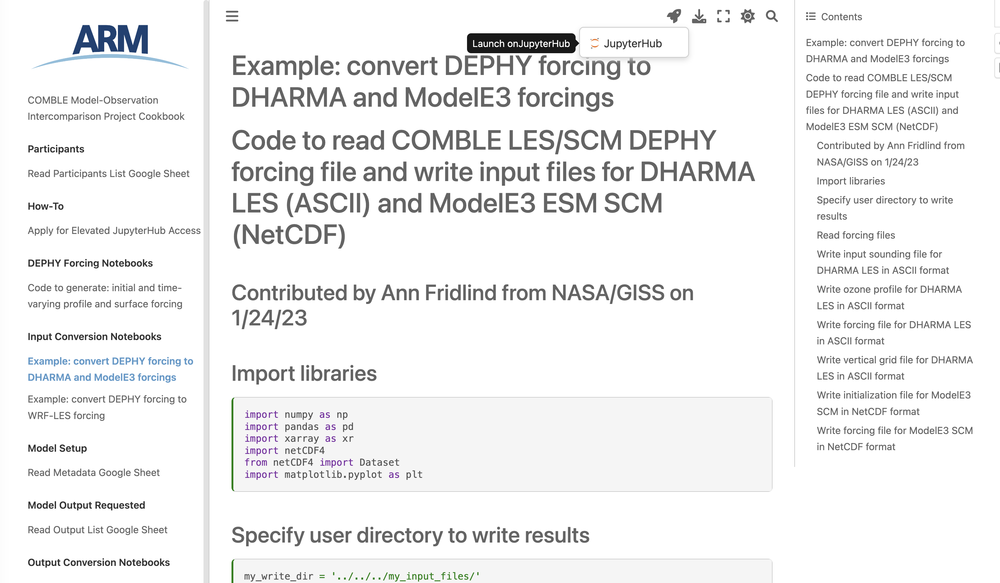
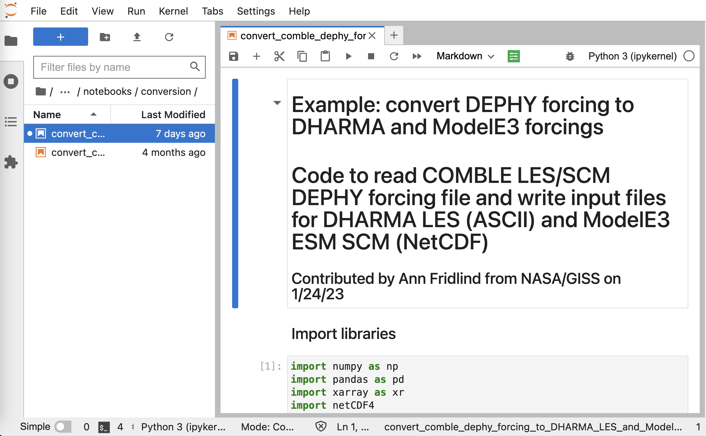
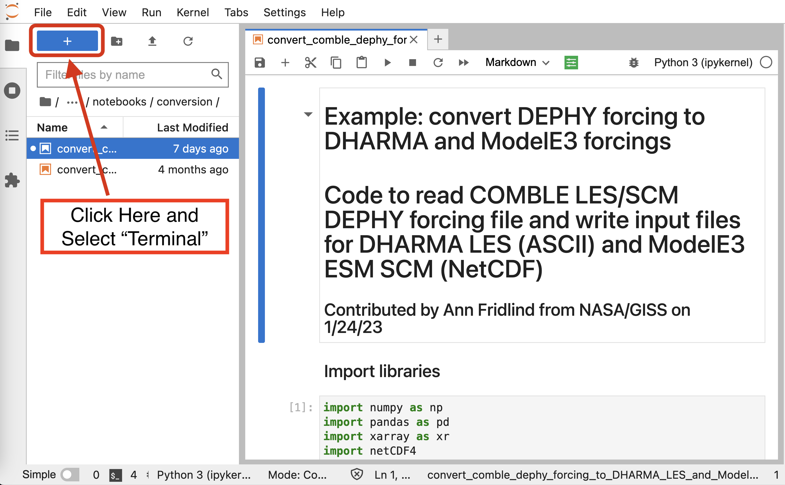
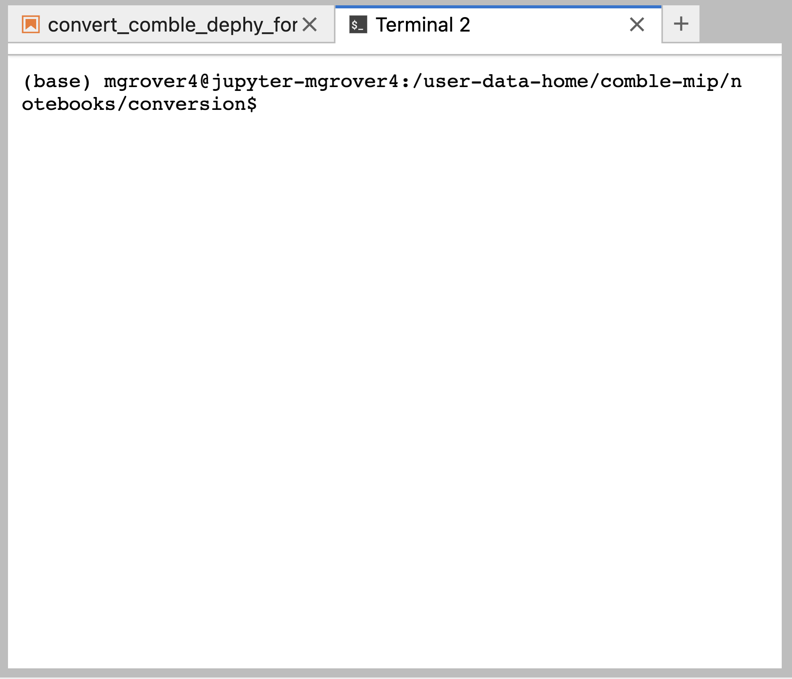
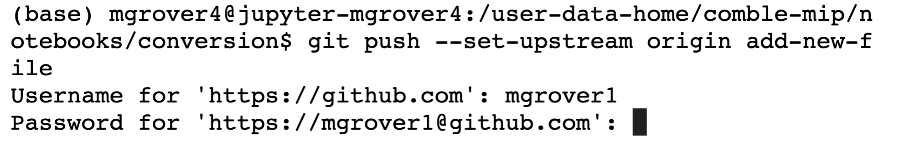
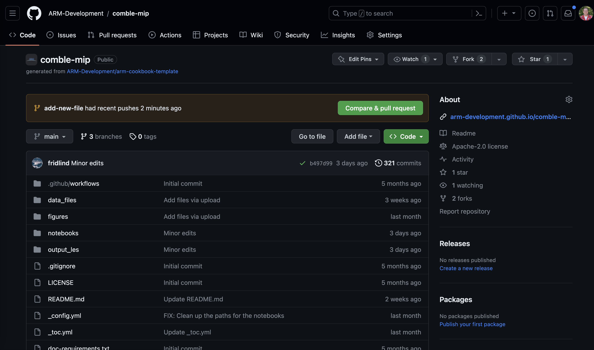
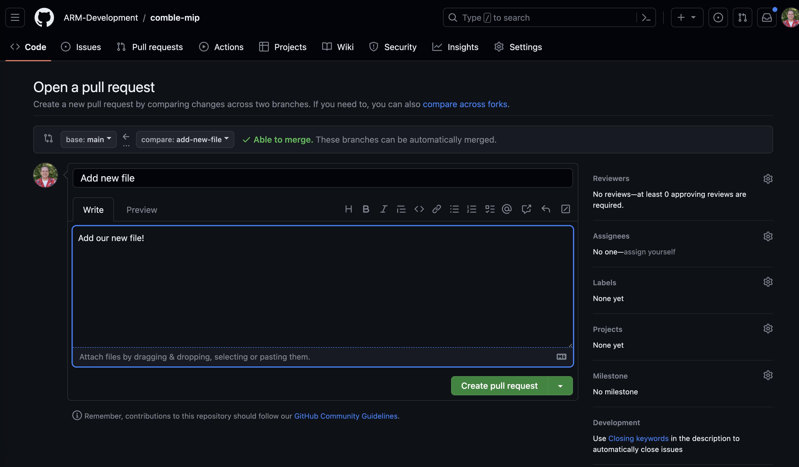

# Contributers Guide

## Cloning Your Code
The first step to contributing is clicking the rocket ship button in the top right part of the page, and selecting the "Launch on Jupyterhub" button.

For example, if you are running the "Convert DEPHY forcing to DHARMA and ModelE3 forcings" notebook, you see the following, selecting the "Launch on Jupyterhub" option.



After logging in using your ARM username/password, and selecting the "Enhanced Science Server", you will launch into your computing environment, with the selected notebook open.



You have now **cloned** your code, creating a copy from the Github website, and placing on the ARM Jupyterhub environment.

## Adding Your Changes

### Open a Terminal and Use Git Command Line Tools
Once you run your notebooks, your data files will update and change. The best way to view these changes is to use the Github command line tools. You will need to open a terminal, using the button in the top left corner, as seen in the figure below, and select terminal.



Once you open a terminal, you will notice that you are in the same directory as the notebook you ran.



### Move to a New Branch
The first step when you have changes you would like to make to the repository is to create a new branch. This is to ensure your changes do not conflict with others.

Use the following line to create a new branch. You will need to choose a branch name (ex. `add-new-file`) that is suitable for your changes. This could be a model name, or something that describes what you changed compared to the data files already added to the project.

```bash
git checkout -b add-new-file
```

### Add Your New File
A good first step to determining which file needs or should be added is to run

```bash
git status
```

This will return which files have been edited or changed, as well as new files existing in the repository.

In our example, we see the the following:

```bash
On branch add-new-file
Changes not staged for commit:
  (use "git add <file>..." to update what will be committed)
  (use "git restore <file>..." to discard changes in working directory)
        modified:   convert_comble_dephy_forcing_to_DHARMA_LES_and_ModelE3_SCM_forcing.ipynb

Untracked files:
  (use "git add <file>..." to include in what will be committed)
        ../forcing/COMBLE_INTERCOMPARISON_NUDGING_FORCING_NEW.nc
        ../forcing/COMBLE_INTERCOMPARISON_SFC_FORCING_ERA5ML_V1.6.nc
        ../forcing/COMBLE_INTERCOMPARISON_SFC_FORCING_NEW.nc

no changes added to commit (use "git add" and/or "git commit -a")
```

You will notice that we modified the `convert_comble_dephy_forcing_to_DHARMA_LES_and_ModelE3_SCM_forcing.ipynb` notebook. We can add add these changes using

```bash
git add convert_comble_dephy_forcing_to_DHARMA_LES_and_ModelE3_SCM_forcing.ipynb
```

Then commit our changes using

```bash
git commit -m 'update forcing notebook'
```

You have now added your changes on your local branch!

## Pushing Your Changes
Now that you have:
1. Cloned your code
2. Ran your notebooks with updated files
3. Created a new branch
4. Added and committed your changes

You are ready to push your changes to the main repository on Github ([ARM-Development/comble-mip](https://github.com/ARM-Development/comble-mip))

**You will need to generate a personal access token and be added as a project contributor before pushing your change to Github**
- Follow [these instructions](https://docs.github.com/en/authentication/keeping-your-account-and-data-secure/managing-your-personal-access-tokens#creating-a-personal-access-token-classic) to create your access token
- E-mail tjuliano@ucar.edu and ann.fridlind@nasa.gov to be added as a project contributor

Once you have your token and have received and accepted your invitation as a project contributor on GitHub, you can run the following

```bash
git push
```

You will be prompted for your Github username and email. Add that information, rerun the `git push` command, and you will see the following:

```bash
fatal: The current branch add-new-file has no upstream branch.
To push the current branch and set the remote as upstream, use

    git push --set-upstream origin add-new-file
```

Copy and paste that last line:

```bash
git push --set-upstream origin add-new-file
```

This will prompt you for username again, as well as your password. Use your newly created personal access token as the password.

See the image below which shows the expected prompt



You did it! This is the last step to pushing your changes.

## Open a Pull Request

Your next step is to go to the [comble-mip](https://github.com/ARM-Development/comble-mip) repository on Github, and look at the top of the page. You should see a prompt suggesting that you open a pull request.



Select the "Compare and Pull Request" button, and add some additional information to the next page. You will want to add:
- A helpful title describing what you are adding or changing
- A detailed description of what you are trying to accomplish



Select "Create Pull Request" when you are ready.

You have opened a pull request! The project maintainers will provide feedback, and you have made your first contribution!

## Suggested Resources
We encourage you to check out the Project Pythia "Getting Started with Github" content if you would like more information about this contribution process and the concept of branches, pull requests, and contributions
- [Link to "Getting Started with Github" Content](https://foundations.projectpythia.org/foundations/getting-started-github.html)
