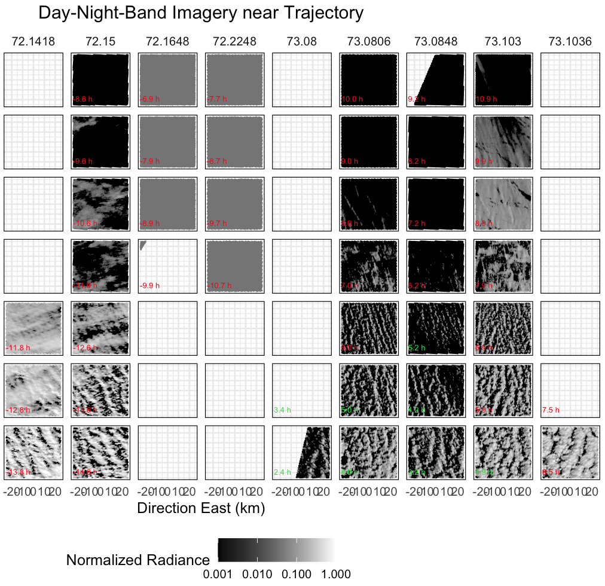

# Where are the rolls?

A prominent feature of most cold-air outbreaks observed during COMBLE, including on 13 March, is the occurrence of prominent roll features in the cloud features nearest to the marginal ice zone. However, these proved to be elusive to reproduce in LES at a strength similar to observations, based on comparisons of pseudo-albedo with satellite images. Below we discuss this problem, which was also encountered during the CONSTRAIN intercomparison.

Figure 1. Visible satellite imagery over the Norwegian Sea region on 13 March 2020 is shown in 50-km domains near the ice edge. Columns indicate latitude and rows indicate hours from the start time (at top, cloud free). Green and red labels indicate the temporal distance in hours from our trajectory location.

___

## References
We encourage you to check out the Project Pythia "Getting Started with Github" content if you would like more information about this contribution process and the concept of branches, pull requests, and contributions
- [Link to "Getting Started with Github" Content](https://foundations.projectpythia.org/foundations/getting-started-github.html)
